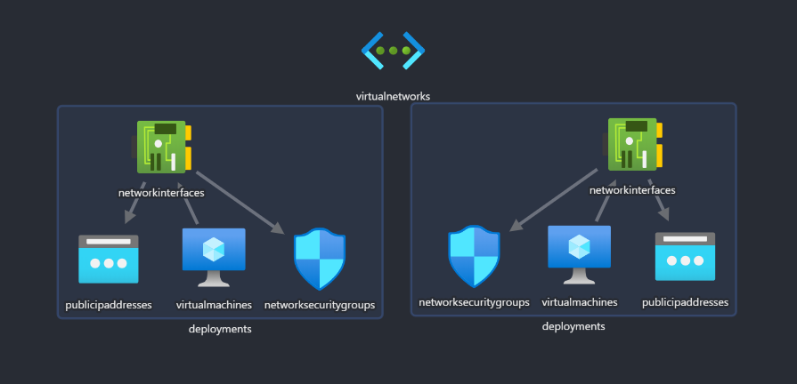
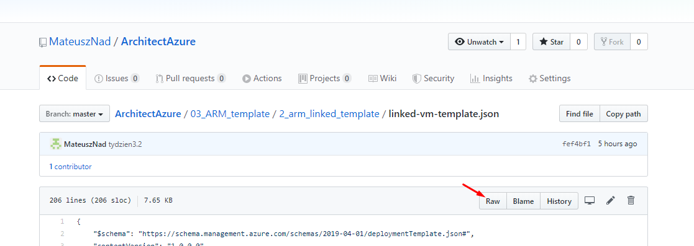

# TYDZIEN 3.

## Zadanie 2 - ARM Template

„Zbuduj prostą konwencję nazewniczą dla min. takich zasobów jak Grupa Zasobów, VNET, Maszyn Wirtualna, Dysk, Konta składowania danych. Pamiętaj o ograniczeniach w nazywaniu zasobów, które występują w Azure”

Zbuduj prosty ARM Template (możesz wykorzystać już gotowe wzorce z GitHub), który wykorzystuje koncepcję Linked Templates. Template powinien zbudować środowisko złożone z jednej sieci VNET, podzielonej na dwa subnety. W każdy subnecie powinna powstać najprostsza maszyna wirtualna z systemem Ubuntu 18.04 a na każdym subnecie powinny zostać skonfigurowane NSG.

## Linked template

Linked template (templateLink -url) z musi zostać umieszczony w lokalizacji do której Azure Resource Manager będzie miał uprawnienia odczytu.

### GitHub

Należy zwrócić na uwagę na poprawną ścieżkę do pliki ARM.

### Azure Storage

- [deploy-azure-storage.ps1](deploy-azure-storage.ps1)

## Visual Studio Code + ARM

Przydatne rozszerzenia:
- Azure Resource Manager (ARM) Tools
- ARM Template Viewer
- ARM Params Generator

## Dodatkowe linki:
- [Using linked and nested templates when deploying Azure resources](https://docs.microsoft.com/en-us/azure/azure-resource-manager/templates/linked-templates)
- [ARM Templates Tutorial | Infrastructure as Code (IaC) for Beginners](https://www.youtube.com/watch?v=Ge_Sp-1lWZ4)
