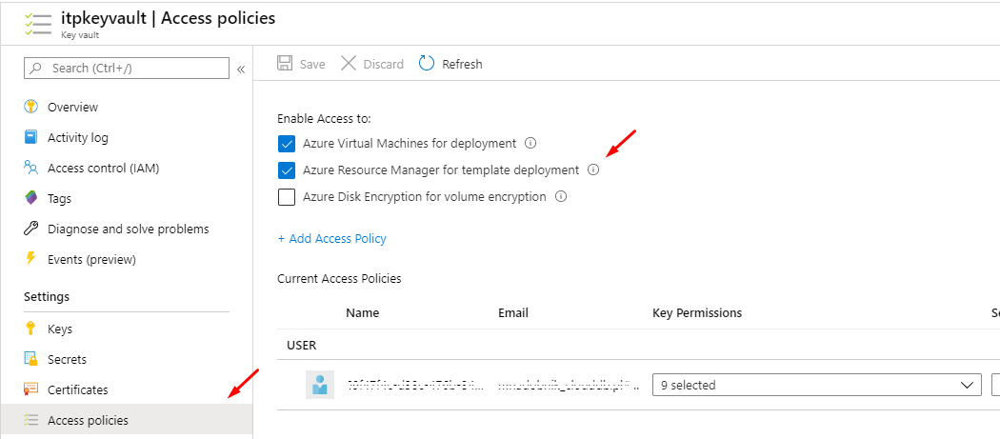

# Azure Key Vault + ARM template

> W celu uniknięcia błędu należy zezwolić na Azure Resource Manager for template deployment



```ps
New-AzResourceGroupDeployment:
Line |
   7 |  New-AzResourceGroupDeployment @DeployParam  -WhatIf:$false
     |  ~~~~~~~~~~~~~~~~~~~~~~~~~~~~~~~~~~~~~~~~~~~~~~~~~~~~~~~~~~
     | The secret of KeyVault parameter 'adminPassword' cannot be retrieved. Http status code: 'Forbidden'. Error message: 'Access denied to first party service.
Caller: name=ARM;tid=f8cdef31-a31e-4b4a-93e4-5f571e91255a;appid=797f4846-ba00-4fd7-ba43-dac1f8f63013;oid=f248a218-1ef9-47bf-9928-ae47093fd442;iss=https://sts.windows.net/f8cdef31-a31e-4b4a-93e4-5f571e91255a/
Vault: itpkeyvault;location=westeurope'. Please see https://aka.ms/arm-keyvault for usage details.
```


## Dodatkowe linki
- [Tutorial: Integrate Azure Key Vault in Resource Manager Template deployment](https://docs.microsoft.com/en-us/azure/azure-resource-manager/templates/template-tutorial-use-key-vault)
