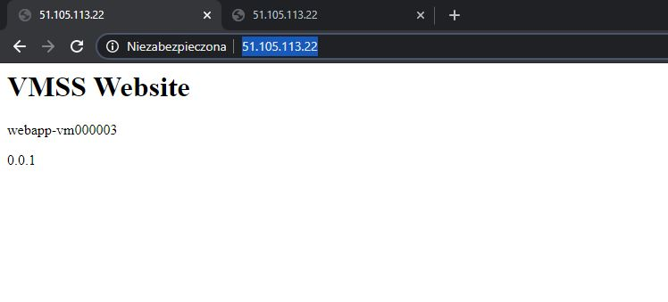
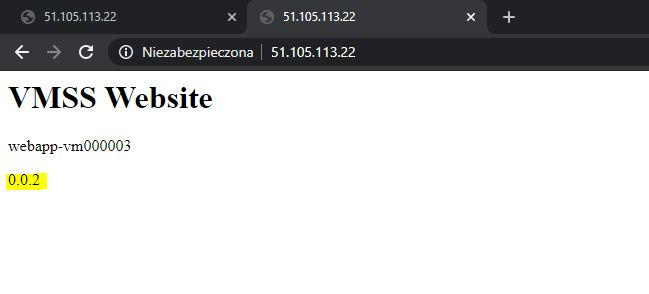

# Opis sytuacji:
Jesteś architektem w dużej firmie (20 000 pracowników, ponad 5000 maszyn wirtualnych, ponad 200 maszyn fizycznych pod środowiskiem wirtualnym), która podjęła decyzję o migracji do Chmury. W firmie jest dość znaczna ilość systemów „legacy” i pierwszy kroki migracji to będzie migracja typu Lift&Shift, gdzie głównie wykorzystasz środowiska maszyn wirtualnych, ale postarasz się zautomatyzować cały proces powoływania i zarządzania środowiskami.

# Zadania

## TYDZIEN4.1

Na bazie swoich doświadczeń i podstawowej wiedzy o maszynach wirtualnych oraz Scale Set zaproponuj kilka kroków, które byś zrealizował w ramach takiej migracji. Przy każdym kroku napisz maksymalnie 2-3 zdania, jakie czynności w takim kroku byś zrealizował.
Pamiętaj o ograniczeniach w chmurze, limitach oraz ograniczeniach co do tego, jakie parametry wirtualnych maszyn, możesz uzyskać w Azure.

> Wszelkie dodatkowe komentarz mile widziane! Wiem, że masz mało danych, ale… wiesz, ja też mam zawsze za mało danych do migracji, co nie powinno mnie powstrzymać, by zaplanować proces.

---

## Odpowiedź

#### 1. Zbieranie danych

Wykonanie inwentaryzacji systemu, która musiałaby obejmować takie informacje jak krytyczność systemu, stos technologiczny, integrację (zależności) pomiędzy systemami, wykorzystywane elementy infrastruktury (AD, dns, content switch), ilość środowisk testowych (myślę, że 60-70% maszyn w organizacji jest wykorzystywanych na potrzeby środowisk testowych) oraz przewidywane plany rozwoju konkretnych systemów.

Dodatkowo duże organizacje posiadają, politykę przestarzałości który informują o systemach z komponentami niespieranymi. Takie informację byłby przydatne do przygotowania migracji (lub zaniechanie działań) dla konkretnych systemów.

#### 2. Konsultacje z dostawcami systemów

Migracje pewnych systemów musiałby zostać poprzedzone konsultacjami z dostawcami  o planach na migrację do chmury publicznej. Ten krok również traktowałbym jako wymianę doświadczeń w temacie takiej migracji.

#### 3. Ułożenie planu migracji

Plan obejmowałbym, wytypowanie systemów "wspólnych", kolejność wykonywać migracji, osoby odpowiedzialne za przeprowadzenie migracji oraz osoby za walidację środowiska.

> Plan uwzględniałbym również, które systemy zostały wykluczone z migracji typu Lift&Shift, np. ze względu na planowane wdrożenie nowego systemu już w podejściu cloud-native.

#### 4. Migracja

W pierwszej kolejności migracją Lift&Shift zostałbym objęte:
- migracja lub rozciągnięcie komponentów "wspólnych", np. Active Directory
- środowiska testowe systemów niekrytycznych
- środowiska testowe systemów krytycznych
- niekrytyczne systemu produkcyjne (uwzględniając zależności)
- krytyczne systemu produkcyjne

> ⚠️ Warunkiem podjęcia decyzji o migracji środowiska produkcyjnego byłoby poprawne działanie środowisk testowych przez np. 2-3 miesiące.


Sposoby migracji:
   - oszacowanie gotowości, wielkości, kosztów oraz automatyczna migracja za pomocą [Azure Migration](https://azure.microsoft.com/en-us/services/azure-migrate/)

   - lub provisioning za pomocą [IaC](https://akademiapowershell.pl/2020/02/infrastracture-as-code-powershell/) oraz konfiguracja np. z wykorzystaniem Azure Automation lub z wykorzystaniem istniejących narzędzi typu Configuration Manager (Ansible, Chef)


### Linki:
- [About Azure Migrate](https://docs.microsoft.com/en-us/azure/migrate/migrate-services-overview)
- [Azure Migrate support matrix](https://docs.microsoft.com/en-us/azure/migrate/migrate-support-matrix)
---

## TYDZIEN4.2 Virtual Machine Scale Set

VMSS nie są często używane w projektach. W ramach zadania nr. 2 napisz mi proszę do jakich warstw aplikacji użyłbyś Scale Set a następnie spróbuj za pomocą Azure CLI zbudować swój prosty Scale Set.

---

## Odpowiedź

Zastosowanie [Virtual Machine Scale Set](https://azure.microsoft.com/en-us/services/virtual-machine-scale-sets/) widziałbym dla warstwy web aplikacji, jeśli hostowana aplikacja nie przetrzymuję stanu sesji użytkownika. Dzięki temu możliwe byłoby skalowanie poziome dla tej warstwy.

### Utworzenie VMSS za pomocą PowerShell (zamiast Azure CLI)

```powershell
# Import-Module Az
# create resource group
($ResourceGroup = New-AzResourceGroup 'webapp-rg' -Location westeurope)

# create virtual machine scale set
$Credential = Get-Credential -UserName 'useradmin'
$paramVsmm = @{
    ResourceGroupName = $ResourceGroup.ResourceGroupName
    VMScaleSetName    = "webapp-vmss"
    UpgradePolicyMode = "Automatic"
    ImageName         = 'MicrosoftWindowsServer:WindowsServer:2019-datacenter-smalldisk-g2:latest'
    Credential        = $Credential
    LoadBalancerName  = "webappslb"
}
($VMScaleSet = New-AzVmss  @paramVsmm )

# add IIS
$Settings = @{
    "fileUris"         = (, "https://raw.githubusercontent.com/MateuszNad/ArchitectAzure/master/04_Migracja/vmss-deploy-web.ps1");
    "commandToExecute" = "powershell -ExecutionPolicy Unrestricted -File vmss-deploy-web.ps1"
}

$paramVmssExtension = @{
    VirtualMachineScaleSet = $VMScaleSet
    Name                   = "customScript"
    Publisher              = "Microsoft.Compute"
    Type                   = "CustomScriptExtension"
    TypeHandlerVersion     = 1.9
    Setting                = $Settings
}
($VMScaleSetExtension = Add-AzVmssExtension @paramVmssExtension )
Update-AzVmss ResourceGroupName  $ResourceGroup.ResourceGroupName -Name $VMScaleSet.Name -VirtualMachineScaleSet $VMScaleSet

# create a rule - allow port 80
$paramNetworkSecurityRuleConfig = @{
    Name                     = 'vmssnsgrule'
    Protocol                 = 'Tcp'
    Direction                = 'Inbound'
    Priority                 = 200
    SourceAddressPrefix      = '*'
    SourcePortRange          = '*'
    DestinationAddressPrefix = '*'
    DestinationPortRange     = 80
    Access                   = 'Allow'
}
($nsgFrontendRule = New-AzNetworkSecurityRuleConfig @paramNetworkSecurityRuleConfig)

# create nsg and assign rule
$paramNetworkSecurityGroup = @{
    ResourceGroupName = $ResourceGroup.ResourceGroupName
    Name              = 'vmmnsg'
    Location          = $ResourceGroup.Location
    SecurityRules     = $nsgFrontendRule
}
($NsgFrontend = New-AzNetworkSecurityGroup @paramNetworkSecurityGroup)

$vnet = Get-AzVirtualNetwork -ResourceGroupName  $ResourceGroup.ResourceGroupName -Name 'webapp-vmss'
$frontendSubnet = $vnet.Subnets[0]

$paramVirtualNetworkSubnetConfig = @{
    VirtualNetwork       = $vnet
    Name                 = $frontendSubnet.Name
    AddressPrefix        = $frontendSubnet.AddressPrefix
    NetworkSecurityGroup = $nsgFrontend
}
($frontendSubnetConfig = Set-AzVirtualNetworkSubnetConfig @paramVirtualNetworkSubnetConfig)
Set-AzVirtualNetwork -VirtualNetwork $vnet

Start-Process "http://$((Get-AzPublicIpAddress -ResourceGroupName $ResourceGroup.ResourceGroupName).IpAddress)"
```

### Efekt wdrożenia



### Aktualizacja VMSS poprzez Custom Script Extension

Zmiana w pliku [vmss-deyploy-web.ps1](.\vmss-deploy-web.ps1) z `$Build = '0.0.1'` na `$Build = '0.0.2'` i aktualizacja Virtual Machine Scale Set.

```powershell
$UpdateSettings = @{
    "fileUris"         = (, "https://raw.githubusercontent.com/MateuszNad/ArchitectAzure/master/04_Migracja/vmss-deploy-web.ps1");
    "commandToExecute" = "powershell -ExecutionPolicy Unrestricted -File vmss-deploy-web.ps1"
}

$VmScaleSet = Get-AzVmss -ResourceGroupName 'webapp-rg2' -VMScaleSetName 'webapp-vmss'
$VMScaleSet.VirtualMachineProfile.ExtensionProfile.Extensions[0].Settings = $UpdateSettings

Update-AzVmss -ResourceGroupName 'webapp-rg2' -VirtualMachineScaleSet $VMScaleSet -VMScaleSetName 'webapp-vmss'
```


Usuniecie grupy zasobów

```ps
Remove-AzResourceGroup -Name 'webapp-rg2' -Force
```


## Dodatkowe linki:

https://medium.com/microsoftazure/updating-azure-vm-scale-set-without-downtime-with-rolling-updates-734dcb540d6b
